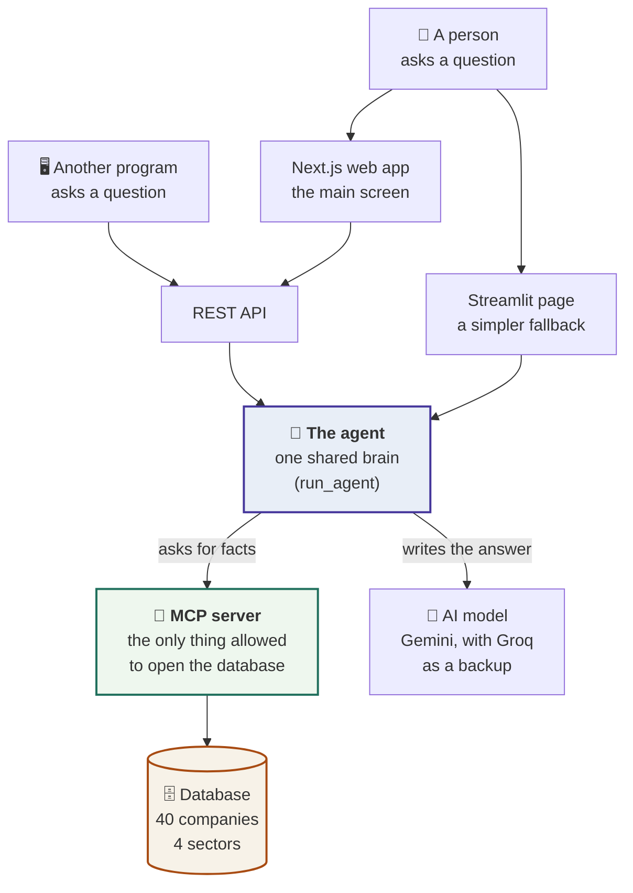
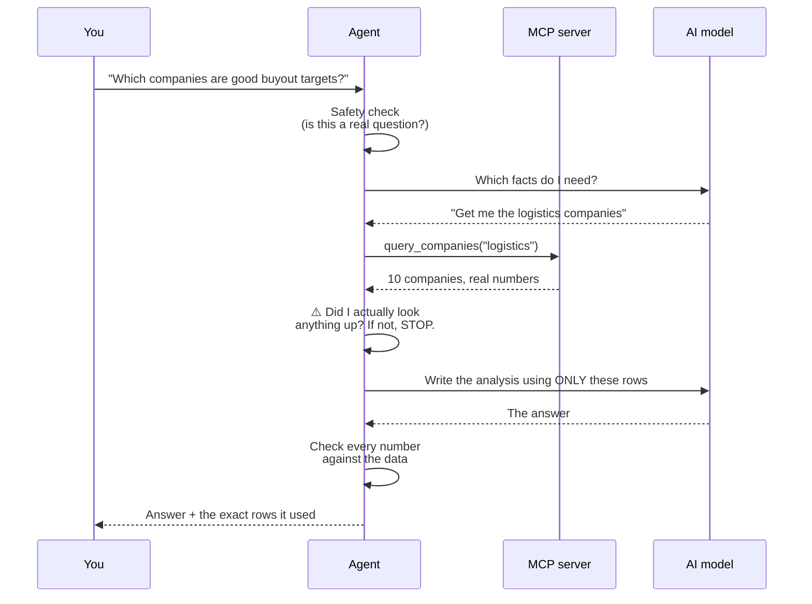

# Sector Analyst Agent

**[Live demo](https://mindtraqk.vercel.app)** · [API docs](https://mindtraqk-m2fgntifva-el.a.run.app/docs) · [Health](https://mindtraqk-m2fgntifva-el.a.run.app/health)

> The demo runs on free-tier infrastructure that scales to zero, so the first request
> after an idle period pays a ~30 second cold start *before* the 60-100 seconds a query
> normally takes. It is not stuck. Subsequent questions are the normal 60-100s.

**Three financial analysts. One set of facts. Three different answers — and every
number is real.**

Ask this system a question like *"is technology a good place to put money right now?"*
and it answers as one of three professionals: a **mutual fund analyst**, an **equity
research analyst**, or a **private equity analyst**.

They all read the *same* database. They still disagree — because they *want different
things*.

> A company with a **weak profit margin**:
> - the **fund analyst** says *avoid it* — it's a broken business she'd be stuck holding.
> - the **private equity analyst** says *buy it* — a weak margin is something he can fix
>   after taking the company over, and that's where his profit comes from.
>
> Same company. Same number. **Opposite conclusions.** That is the whole point of this
> project, and it's measured automatically rather than just claimed.

The other half of the project is **honesty**. The agent is only allowed to talk about
40 real companies whose financial data is stored in a database. Ask it about a company
it doesn't have — SpaceX, say — and it tells you it has no data, instead of inventing a
confident-sounding answer. Making an AI say *"I don't know"* is harder than making it
sound clever, and it's the behaviour this system is built and tested for.

---

## How it works, in one picture



Three ways in, one brain. The **Next.js app** is the screen this is meant to be seen
on; it goes through the REST API, so it uses exactly the door another program would.
The **Streamlit page** is a plainer fallback that calls the agent directly. Neither UI
holds a second copy of the reasoning — they both end up in the same function.

**The important part is the wall in the middle.** The agent is *never* allowed to open
the database itself. It has to ask the MCP server, which is a separate program running
on its own. This is like a bank teller: customers don't walk into the vault, they ask
the teller, and the teller is the only one with the key.

Why bother? Because it forces every fact to come through one controlled door that can
be inspected, limited, and logged. The project has an automated test that **fails the
build** if any developer ever writes code that opens the database directly.

## What happens when you ask a question



The two grey steps are the safety net:

- **"Did I actually look anything up?"** If the AI tries to answer from memory without
  checking the database, the system refuses to send that answer at all. An answer with
  no lookup cannot be trusted, so it never ships.
- **"Check every number."** After the AI writes its answer, the system re-reads every
  figure in it and confirms it appears in the data that was actually retrieved.

---

## Run it

```powershell
copy .env.example .env    # add GOOGLE_API_KEY (free: aistudio.google.com)
docker compose up
```

Or use the hosted demo above — no setup at all.

| What | Where |
|---|---|
| **The web app — start here** (Next.js, the primary UI) | http://localhost:3000 |
| Side-by-side view: one question, all three analysts | http://localhost:3000/compare |
| The simpler fallback UI (Streamlit) | http://localhost:8501 |
| API documentation | http://localhost:8000/docs |
| Health check | http://localhost:8000/healthz |
| MCP endpoint | http://localhost:8765/mcp |

`docker compose up` starts all four services — MCP server, API, Streamlit, and the
Next.js app.

The database ships with the code, so nothing is downloaded on first run. You need
**one free API key** (Google AI Studio, no credit card). Langfuse keys are optional —
without them the app runs perfectly with tracing turned off, and that path is tested.

**How long it takes, measured rather than guessed:** the first `docker compose up`
builds two images. The Python one — MCP server, API and Streamlit all run from it — was
timed at about **15 minutes** from a fresh `git clone`, nearly all of it installing ~100
pinned Python packages (526 seconds on the build machine). The Next.js image builds
alongside it and adds an `npm ci` and a production build, which has not been timed
separately. Every start after that comes off the cache in seconds.

<details><summary>Running it without Docker (PowerShell)</summary>

```powershell
python -m venv venv; .\venv\Scripts\Activate.ps1
pip install -r requirements.txt

python -m app.mcp_server.server                      # terminal 1 — port 8765
uvicorn app.api.main:app --port 8000                 # terminal 2 — port 8000
streamlit run app/ui_streamlit/app.py                # terminal 3 — port 8501

cd web; npm install; npm run dev                     # terminal 4 — port 3000
```

Four terminals, because these are four separate programs. `docker compose up` runs all
four for you; this is the version for working on one of them. The Next.js app needs
Node (the Docker image pins Node 22) and talks to the API on port 8000, so terminals 1
and 2 have to be up first.

Rebuild the database from public sources: `python scripts/build_db.py`
</details>

## Things worth trying

| Ask as | About | Question |
|---|---|---|
| all three | tech | Is this sector a good place to put money to work right now? |
| fund analyst | retail | Which would fit a long-term core holding versus a name to avoid? |
| equity analyst | manufacturing | Walk me through the margin profile — who's improving and who's under pressure? |
| PE analyst | tech | If I had to take one company private, which and what's the operational thesis? |
| any | any | What's the most recent headcount signal you have for NVDA? |
| any | any | What do you think about SpaceX? *(it isn't in the data — watch it say so)* |

Asking the same question as all three analysts is the most interesting thing you can do
here — http://localhost:3000/compare does it in one click and shows the three answers
side by side.

```powershell
curl.exe -X POST http://localhost:8000/v1/query `
  -H "Content-Type: application/json" `
  -d '{\"query\":\"Which companies look like attractive buyout targets?\",\"persona\":\"pe_analyst\",\"sector\":\"logistics\"}'
```

**A note on the brief's `sector=logistics` example:** logistics is a real sector here,
so that request works and returns 200. The brief's worked example and its API test both
use it, so shipping four sectors instead of three means every question in the brief runs
exactly as written. Asking for a sector that doesn't exist returns a clear error rather
than a crash or a made-up answer:

```json
{"detail": "Unknown sector 'energy'. Valid: tech, retail, manufacturing, logistics",
 "valid_sectors": ["tech", "retail", "manufacturing", "logistics"]}
```

---

# The engineering

*Everything above is the what. This is the how, and why each choice was made.*

## The data

40 real companies across four sectors, built from two public sources.

- **Yahoo Finance** (`yfinance`) — the financial figures. Trailing-twelve-month, so it
  can lag official filings by a quarter.
- **SEC EDGAR** — the *date* on every employee-count figure.

That second one deserves an explanation, because it's the kind of detail that decides
whether a system is trustworthy. Yahoo gives you an employee count as a bare number with
no date attached. Stamping it with today's date would be *inventing provenance* — making
the data look fresher than it is, in the exact field this assessment uses to catch
invention. So each headcount is dated to the period end of that company's most recent
**Form 10-K** and cited to the filing itself. If EDGAR can't be reached, the date is
stored as empty with a note saying why, and the agent reports the figure as undated.

An undated fact is reported as undated. That's the rule.

**Known data limits, stated plainly:**

- Yahoo reports `debtToEquity` as a percentage; it's divided by 100 on the way in.
- Yahoo reports `dividendYield` as a **percentage** (`1.96` = 1.96%) but
  `trailingAnnualDividendYield` as a **fraction**. Telling them apart by size is wrong: a
  "divide by 100 only if bigger than 1" rule silently stores every sub-1% yield **100×
  too high**. Both are handled explicitly. This bug was caught and fixed during the build.
- Some companies return incomplete data; those fields are stored empty, never as zero.
- The snapshot is dated, and confidence drops as it ages — answers get *less* confident
  over time rather than quietly stale.

## The database design

Three tables: **who a company is**, **what its numbers were on a given date**, and
**dated soft facts** like employee counts.

The reason they're separate: a company's identity doesn't change, but its financials are
a *time series*. Keeping them apart means every answer can say *as of when* it is true,
and re-running the data collector adds history instead of destroying it.

- **Missing data is stored as empty, never as zero.** "We don't know this company's
  margin" and "this company's margin is zero" are completely different facts, and
  confusing them is one of the easiest ways to make an AI lie. The interface shows an
  em dash, never a `0`.
- **Every table records where its data came from.** Provenance is a column, not a
  footnote in a document.
- Uniqueness constraints make re-running the collector safe — including a subtle one:
  SQLite treats empty values as always-different, so an undated fact would duplicate on
  every run without a special index.

## The MCP boundary

Seven tools are exposed: `list_sectors`, `dataset_overview`, `query_companies`,
`search_companies`, `get_company_detail`, `get_company_signals`, `compare_companies`.

- **There is deliberately no "run any query" tool.** Letting an AI write raw database
  queries is both a security hole and a correctness hazard. Each tool does one specific,
  typed job.
- **`compare_companies` checks its inputs against a fixed list.** The field names it
  accepts become part of a database query, and that kind of value can't be safely
  escaped — so anything not on the approved list is rejected outright. Four attack
  payloads are tested against it.
- **"I don't have that" is a real answer, not an error.** `search_companies` returning
  an empty list is an *authoritative* "not in the dataset" — which means the agent can
  **look up** the fact that it has no data, rather than guessing. That's what makes an
  honest refusal grounded in evidence.
- **The tool descriptions are load-bearing, and one nearly broke silently.** FastMCP
  builds each tool's description from its documentation up to the `Args:` section and
  quietly discards the rest. Guidance written below that line never reaches the AI at
  all, with no error. Tests now assert every tool's *registered* description still
  contains its "what an empty result means" instruction.
- **The boundary is enforced by a test, not by good intentions.** It parses the code of
  every file that talks to the agent, the API and the UI, and fails if any of them
  imports the database layer. A companion test proves the check itself can still fail,
  so it can't quietly rot into something that always passes.

## How the three analysts actually differ

They are not the same answer with different adjectives. The difference is stored as
**data** — a table of what each lens concludes from a given signal — and the instructions
given to the AI are generated *from* that table, so the two can never drift apart.

| Signal | Fund analyst | Equity analyst | PE analyst |
|---|---|---|---|
| Weak operating margin | negative | negative | **positive** — something to fix |
| High revenue growth | positive | positive | **negative** — too expensive to buy |
| High dividend yield | positive | neutral | **negative** — cash that should repay debt |
| High share volatility | negative | neutral | ignored — a private company isn't traded |

A test requires at least three signals where one analyst says *positive* and another
says *negative*. If the personas ever stop genuinely disagreeing, **the build fails.**

One honesty detail: the fund analyst is defined as judging companies against a market
benchmark — but this database has no benchmark data. Rather than let it invent an index
level, its instructions require it to compare against the companies it actually
retrieved and to *say out loud* that the peer group is standing in for a benchmark.

## The screen (Next.js)

The brief says "Streamlit **or equivalent**", so the primary UI is a Next.js 15 app in
`web/` and the Streamlit page stays as a fallback. It is laid out as a desk rather than
a chat app: a **rail** on the left for who is reading and what they are reading over, an
**answer column** in the middle, and an **evidence panel** on the right holding the exact
database rows behind the answer. Below 1100px the evidence panel moves under the answer;
below 720px the rail collapses to two dropdowns.

**The evidence panel fills before the answer arrives.** That ordering is the point of
the screen. A reviewer's real question is "is it retrieving, or making it up?", and the
honest way to answer it is to show the rows landing first and the prose arriving after
them, rather than asking anyone to trust a citation list printed at the end.

**`/compare` runs one question through all three analysts** and puts the three
conclusions in three columns — the headline claim of this project, performed rather than
asserted. Each column lists the companies its own run read, and the footer counts how
many were read by *every* lens, so the "same data, different conclusions" line is
measured on screen instead of assumed. The three runs are **sequential, not parallel**:
three simultaneous agent runs is the most quota-exposed thing this system can do on a
free-tier model with a per-minute limit, and firing them together is how a live demo
earns a rate-limit error in front of the person evaluating it. Each column also fails on
its own, so a rejected third run does not blank the two conclusions already on screen.

**The answer is not streamed word by word, and the UI does not pretend it is.** The
final answer is a *structured object* with typed fields, and a half-parsed object is not
a partial answer — it is nothing you can show anybody. So `POST /v1/query/stream` sends
what is genuinely ready when it is ready: `progress` events named after the graph step
that just finished ("Querying the database over MCP", "Reasoning as the analyst"), then
`evidence` the moment the rows come back, then the complete `response`, then `done`.
Fake word-by-word streaming would have looked busier and told the user less.

## The safety layers

| Stage | What it does |
|---|---|
| Before the AI runs | blocks prompt-injection attempts, redirects off-topic questions, strips personal data |
| While it runs | refuses to ship any answer produced without a database lookup |
| After it answers | verifies every company and figure against retrieved data, attaches the not-advice notice |

Two decisions worth naming:

**Confidence is calculated, never self-reported.** The AI is never asked how confident
it is. Confidence is computed from the evidence — how many companies were found, how
many fields were missing, how old the snapshot is. AI models are famously bad at judging
their own certainty; the data knows exactly how complete it is. The AI's response format
has no confidence field at all, so it cannot talk itself up.

**Personal data is removed before it travels, not just before it's logged.** If you put
an email address in your question, the redacted version is what reaches the AI provider
and the tracing service.

The "check every number" step took four rounds of fixes to stop punishing *correct*
answers. It now understands that a figure can be restated as a percentage, scaled to
billions, or **calculated** from two fields of the same company; that `15-16x` is a range
and not the number `-16`; and that filing reference numbers, dates and web links are full
of digits but contain no claims. A test confirms the relaxed version still catches a
genuinely invented number.

## Does it work? The evidence

`python evals/run_eval.py` runs 27 graded test cases and writes
[`evals/results/report.md`](evals/results/report.md).

| What's measured | Target | Result |
|---|---|---|
| Refuses to discuss companies it lacks data on | 100% | **100%** |
| Every figure traceable to real data | ≥ 95% | **100%** |
| The three analysts genuinely diverge | ≥ 0.55 | **0.816** |
| Answers written without looking anything up | 0 | **0** |

**Groundedness is checked by arithmetic, not by another AI.** A popular approach is to
have a second AI judge whether an answer is faithful. That was rejected: it needs a
second paid provider (breaking the "one free key" promise), and an AI's opinion isn't
repeatable enough to gate a build on. Instead every figure is matched against the actual
retrieved rows, using the same code that runs in production.

**Divergence is scored on conclusions, not vocabulary.** The obvious way to measure it —
counting how differently the analysts *write* — is circular, because the vocabulary is
supplied by the instructions in the first place. It would score highest on exactly the
cosmetic difference the brief says doesn't count. A test proves the point: three answers
stuffed with distinct analyst jargon but recommending the *same companies* score **below
the passing bar**.

The decisive test is simpler. The same weak-margin company is put to the fund analyst
and the PE analyst, and they must reach opposite conclusions from an identical row:

> **Fund analyst:** "its weak operating margin is a clear reason to **avoid** it"
> **PE analyst:** "this is a significant **opportunity** rather than a defect"

No amount of clever wording can fake that.

## The AI model, and what happens when it fails

**Google Gemini 2.5 Flash** is the primary, with **Groq** as an automatic backup. The
free Gemini tier limits how many requests you can make per minute, and rate limits and
network blips were the single largest source of failures while building this.

The backup switches in at the *model* level, so a failure halfway through doesn't throw
away work already done or re-run database queries. One subtlety mattered: the two
providers need to be asked for structured output in **different ways**, so each is
configured separately. Configuring them together would have meant the backup broke at
the exact moment it was needed — which is the worst possible time to find out.

`GET /healthz` reports which providers are live. Set only `GOOGLE_API_KEY` and the
backup is simply absent; nothing breaks.

## What I'd do next

**Track data over time.** The database is already designed for it — figures are stored
with a date, and re-running the collector adds new snapshots rather than overwriting.
Today every analyst reasons about a single moment. That's the sharpest limitation here:
the equity analyst is asked *"who's improving and who's under pressure?"* and can only
infer a direction from a single static number. With two or three snapshots it could
answer that question directly, and the PE analyst could underwrite a trend rather than a
level.

After that: send only the fields the active analyst actually cares about to the AI
(roughly halving the cost per question — the tool for it already exists), and make
`/compare` share its retrieval. Today each of its three columns is a full independent
agent run, so the same rows are fetched three times; one lookup fanned out to all three
analysts would be cheaper, faster, and a stricter proof that the columns really are
reading identical data.

## What this deliberately does not do

- No user accounts or multi-tenancy — it's a single-user assessment.
- No live market prices; every answer states the date of its data.
- No vector search. The data is numbers in tables, so ordinary database queries are the
  right tool; adding AI-style semantic search here would be technology for its own sake.
- No model fine-tuning — the analysts differ through instruction design, not training.
- **This is not investment advice**, and a guardrail enforces that on every answer.

## Where things live

```
app/
  config.py            settings; one place any key is named
  logging_conf.py      structured logs, each tagged with a request id
  data/                schema.sql, db.py (all database access), financials.db
  mcp_server/          the only program that opens the database
  agent/               personas, sectors, prompts, guardrails, graph, runner, llm
  api/                 REST endpoints, live-updating stream, health
  ui_streamlit/        the fallback page, calling the same agent directly
web/                   the primary UI — Next.js 15, TypeScript, Tailwind
  app/                 the desk page, the /compare route, global styles
  components/          desk rail, answer block, evidence panel, compare view
  lib/                 the one module that calls the API, plus formatting and types
scripts/               build_db.py (rebuild data), smoke_test.py
evals/                 the 27 test cases, the scorer, the committed report
tests/                 263 tests — no network, no API key needed
```

Run the checks: `pytest -q` and `ruff check .`
