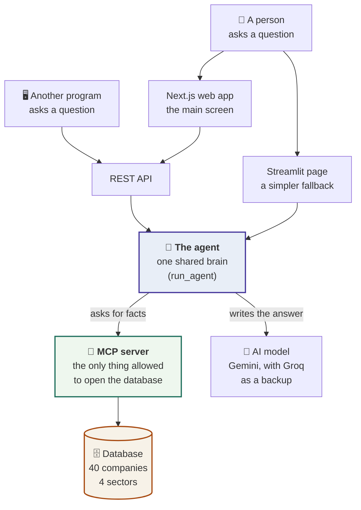
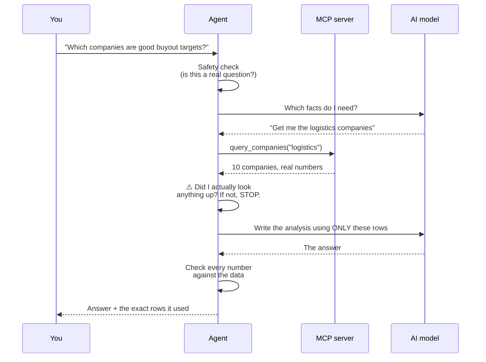

# Sector Analyst Agent

**[Live demo](https://automatisor.vercel.app)**

> The demo runs on free infrastructure that sleeps when idle. The first request
> after a quiet period takes ~30 seconds to wake up, then 60–100 seconds per
> question. It is not stuck — subsequent questions are the normal 60–100s.

**Three financial analysts. One database. Three different answers — every number
is real.**

Ask a question like *"is tech a good place to put money right now?"* and the
system answers as one of three professionals:

| Analyst | What they do |
|---|---|
| **Mutual Fund Analyst** | Picks stocks for everyday investors |
| **Equity Research Analyst** | Writes reports for institutional traders |
| **Private Equity Analyst** | Buys entire companies to fix and resell |

They all read the **same 40 companies** from the **same database**. They still
disagree — because they *want different things*:

> A company with a **weak profit margin**:
> - The **fund analyst** says *avoid it* — a broken business she'd be stuck
>   holding.
> - The **PE analyst** says *buy it* — weak margins are something he can fix
>   after taking it private, and that's where his profit comes from.
>
> Same company. Same number. **Opposite conclusions.**

The other half of this project is **honesty**. Ask about a company not in the
database — SpaceX, say — and the agent tells you it has no data instead of
making something up. Teaching an AI to say *"I don't know"* is harder than
making it sound clever.

---

## How it works



**In plain English:** there are three ways to ask a question (a web app, a
simple page, or a program), but they all reach the **same brain**. That brain is
never allowed to open the database directly — it has to ask a separate service
called the **MCP server**, which is the only thing with the key. Think of it
like a bank: customers don't walk into the vault, they ask the teller.

An automated test **fails the build** if any developer ever writes code that
bypasses this wall.

---

## What happens when you ask a question



Two safety steps matter most:

- **"Did I actually look anything up?"** — If the AI tries to answer from
  memory without checking the database, the system refuses to send that answer.
  No lookup = no response.
- **"Check every number."** — After the AI writes its answer, every figure is
  verified against the data that was actually retrieved.

---

## Quick setup

### Option 1: Docker (recommended — one command)

```powershell
copy .env.example .env          # then add your GOOGLE_API_KEY
docker compose up
```

### Option 2: Run locally (PowerShell)

```powershell
python -m venv venv; .\venv\Scripts\Activate.ps1
pip install -r requirements.txt

# Open four terminals:
python -m app.mcp_server.server                     # terminal 1 — port 8765
uvicorn app.api.main:app --port 8000                # terminal 2 — port 8000
streamlit run app/ui_streamlit/app.py               # terminal 3 — port 8501
cd web; npm install; npm run dev                    # terminal 4 — port 3000
```

### What you need

| Need | How to get it | Cost |
|---|---|---|
| **Google API key** (required) | [aistudio.google.com](https://aistudio.google.com) → Get API key | Free, no credit card |
| **Groq API key** (optional backup) | [console.groq.com](https://console.groq.com) → API Keys | Free, no credit card |
| **Langfuse keys** (optional tracing) | [cloud.langfuse.com](https://cloud.langfuse.com) → New project | Free tier |

Paste the key(s) into your `.env` file. The database ships with the code — nothing
is downloaded on first run.

### Where everything lives once running

| What | URL |
|---|---|
| **Web app — start here** | http://localhost:3000 |
| Side-by-side analyst comparison | http://localhost:3000/compare |
| Simpler fallback UI (Streamlit) | http://localhost:8501 |
| API docs (Swagger) | http://localhost:8000/docs |
| Health check | http://localhost:8000/healthz |

### Build time

First `docker compose up` takes **~15 minutes** (mostly installing Python
packages). Every start after that takes seconds from cache.

---

## Things worth trying

| Analyst | Sector | Question |
|---|---|---|
| All three | tech | Is this sector a good place to put money to work right now? |
| Fund analyst | retail | Which would fit a long-term core holding versus a name to avoid? |
| Equity analyst | manufacturing | Walk me through the margin profile — who's improving? |
| PE analyst | tech | If I had to take one company private, which and what's the thesis? |
| Any | any | What do you think about SpaceX? *(watch it say "I don't have data")* |

The most interesting thing: ask the **same question as all three analysts** at
http://localhost:3000/compare and see three different conclusions side by side.

**API example:**

```powershell
curl.exe -X POST http://localhost:8000/v1/query `
  -H "Content-Type: application/json" `
  -d '{\"query\":\"Which companies look like attractive buyout targets?\",\"persona\":\"pe_analyst\",\"sector\":\"logistics\"}'
```

---

## Schema decisions

The database has **three tables**, and each separation exists for a reason:

```
companies    — who a company is (ticker, name, sector)
financials   — what its numbers were on a given date
signals      — dated soft facts (employee count, hiring notes)
```

| Decision | Why it matters |
|---|---|
| **`financials` is separate from `companies`** | A company's identity doesn't change, but its numbers are a time series. Separating them means every answer can say *as of when* it is true, and re-running the data collector adds history instead of destroying it. |
| **`signals` is its own table** | Headcount and hiring notes are qualitative, irregularly dated, and don't belong in a numeric snapshot row. This is what makes the "when was the headcount last updated?" question answerable with a real date. |
| **Every table has a `source` column** | Provenance is a first-class data column, not a footnote. The agent returns it so any claim can be audited. |
| **Missing data is `NULL`, never `0`** | "We don't know this company's margin" and "this company's margin is zero" are completely different facts. Confusing them is one of the easiest ways to make an AI lie. The UI shows a dash, never `0`. |
| **Fields are chosen to serve the three analyst lenses** | Fund analyst needs `revenue_growth`, `beta`, `dividend_yield`. Equity needs margins and `roe`. PE needs `free_cash_flow`, `debt_to_equity`, `ev_to_ebitda`. The schema exists to make genuine disagreement possible. |

**Data quality — stated honestly:**

- Yahoo Finance numbers are trailing-twelve-month and can lag filings by a quarter.
- `debtToEquity` comes as a percentage (e.g. `154.0` = 1.54×) — it's normalized on import.
- `dividendYield` vs `trailingAnnualDividendYield` use different units (percentage vs
  fraction) — both are handled explicitly. This bug was caught and fixed during the build.
- Some companies return incomplete data — those fields are stored `NULL`, never zero.
- Employee headcount is dated to the company's most recent 10-K filing via SEC EDGAR,
  not stamped with today's date. An undated fact is reported as undated.

---

## MCP design

**MCP** (Model Context Protocol) is the wall between the AI agent and the
database. The agent is the *client*; the MCP server is the *server*. The agent
can never touch the database directly — it must ask through these seven tools:

| Tool | What it does |
|---|---|
| `list_sectors` | Returns the list of available sectors |
| `dataset_overview` | Summary stats about the whole dataset |
| `query_companies` | Gets companies in a sector — the workhorse |
| `search_companies` | Looks up a company by name or ticker |
| `get_company_detail` | Full profile of one company |
| `get_company_signals` | Headcount, hiring notes, news for a company |
| `compare_companies` | Side-by-side comparison of specific companies on specific fields |

### Why it's designed this way

| Principle | Explanation |
|---|---|
| **No "run any query" tool** | Letting an AI write raw SQL is both a security hole and a correctness disaster. Each tool does one specific, typed job. |
| **"I don't have that" is a real answer** | `search_companies` returning an empty list is an *authoritative* "not in the dataset" — the agent can look up the fact that it has no data, rather than guessing. |
| **Field names are validated against a fixed list** | `compare_companies` accepts only pre-approved field names because untrusted field names can't be safely placed in SQL. Four attack payloads are tested against it. |
| **Stateless and read-only** | No sessions, no cursors, no write tools. Any client can call it, and no tool call can corrupt the dataset. |
| **Tool descriptions are load-bearing** | FastMCP builds each tool's description from its docstring up to the `Args:` section and silently discards the rest. Tests assert every tool's *registered* description still contains its critical guidance. |
| **The boundary is enforced by a test** | A test parses the code of every file that talks to the agent and fails if any of them imports the database layer. A companion test proves the check itself can still fail, so it can't quietly rot. |

---

## How the three analysts differ

They are **not** the same answer with different adjectives. The difference is
stored as **data** — a table of what each analyst concludes from a given signal —
and the AI's instructions are generated *from* that table.

| Signal | Fund analyst | Equity analyst | PE analyst |
|---|---|---|---|
| Weak operating margin | negative | negative | **positive** — something to fix |
| High revenue growth | positive | positive | **negative** — too expensive to buy |
| High dividend yield | positive | neutral | **negative** — cash that should repay debt |
| High share volatility | negative | neutral | ignored — private company isn't traded |

A test requires at least three signals where one analyst says *positive* and
another says *negative*. If the personas ever stop genuinely disagreeing, **the
build fails.**

---

## Safety layers

| When | What it does |
|---|---|
| **Before the AI runs** | Blocks prompt-injection attempts, redirects off-topic questions, strips personal data |
| **While it runs** | Refuses to ship any answer produced without a database lookup |
| **After it answers** | Verifies every company and figure against retrieved data, attaches the "not investment advice" notice |

**Confidence is calculated, never self-reported.** The AI is never asked how
confident it is. Confidence is computed from the data — how many companies were
found, how many fields were missing, how old the snapshot is.

**Personal data is removed before it travels.** If you put an email address in
your question, the redacted version is what reaches the AI provider and the
tracing service.

---

## Does it work? The evidence

`python evals/run_eval.py` runs **27 graded test cases** and writes
[`evals/results/report.md`](evals/results/report.md).

| What's measured | Target | Result |
|---|---|---|
| Refuses to discuss companies not in the data | 100% | **100%** |
| Every figure traceable to real data | ≥ 95% | **100%** |
| The three analysts genuinely diverge | ≥ 0.55 | **0.816** |
| Answers without any database lookup | 0 | **0** |

**Groundedness is checked by code, not by another AI.** Every figure is matched
against the actual retrieved rows. No second paid provider needed.

**Divergence is scored on conclusions, not vocabulary.** Three answers using
different jargon but recommending the *same companies* score below the passing
bar. The decisive test: the same weak-margin company is given to the fund analyst
and PE analyst, and they must reach opposite conclusions from identical data.

---

## The AI model and fallback

**Google Gemini 2.5 Flash** is the primary model (free tier). **Groq** is an
automatic backup that kicks in when Gemini is rate-limited or down.

The backup switches at the *model* level — a failure halfway through doesn't
throw away work already done. The two providers need structured output configured
differently, so each is set up separately (not shared config that would break at
the worst time).

`GET /healthz` reports which providers are live. Set only `GOOGLE_API_KEY` and
the backup is simply absent — nothing breaks.

---

## What I'd improve with more time

**Track data over time — this is the single sharpest limitation.**

The database is already designed for it: figures are stored with a date, and
re-running the collector adds new snapshots rather than overwriting. But today
every analyst reasons about a single moment. That matters most for the equity
analyst — asked *"who's improving and who's under pressure?"*, they can only
infer a direction from one static number. With two or three snapshots they could
answer that question directly, and the PE analyst could underwrite a *trend*
rather than a *level*.

The specific improvements, in priority order:

| Improvement | Why it matters | Effort |
|---|---|---|
| **Multiple data snapshots** | Enables trend-based reasoning instead of point-in-time guesses. Unlocks questions like "is this company improving?" that today can only be inferred. | Medium — schema supports it, collector and prompts need updating |
| **Persona-aware field filtering** | Send only the fields each analyst actually cares about to the AI. Roughly halves token cost per query. The tool for it already exists but isn't wired in. | Low |
| **Shared retrieval for `/compare`** | Today each of the three columns in the comparison view runs a full independent agent query — the same rows are fetched three times. One lookup fanned out to all three analysts would be cheaper, faster, and a stricter proof that they're reading identical data. | Medium |
| **Streaming with partial structured output** | The answer is a typed structured object, so true word-by-word streaming isn't possible today. Investigating partial structured output parsing would let the UI show fields as they complete. | High |

Each of these is a *named tradeoff* — the current design was chosen deliberately
to ship a working, tested system first, and these are the specific next steps
with eyes open.

---

## What this deliberately does not do

- No user accounts — it's a single-user assessment tool.
- No live market prices — every answer states the date of its data.
- No vector search — the data is numbers in tables, so regular SQL queries are
  the right tool. Adding semantic search here would be technology for its own sake.
- No model fine-tuning — the analysts differ through instruction design, not
  training.
- **This is not investment advice**, and a guardrail enforces that on every
  answer.

---

## Project structure

```
app/
  config.py              settings — one place any key is named
  logging_conf.py        structured logs, each tagged with a request id
  data/                  schema.sql, db.py (all database access), financials.db
  mcp_server/            the only program that opens the database
  agent/                 personas, sectors, prompts, guardrails, graph, runner, llm
  api/                   REST endpoints, live-updating stream, health
  ui_streamlit/          the fallback page — calls the same agent directly
web/                     the primary UI — Next.js 15, TypeScript, Tailwind
  app/                   the desk page, the /compare route, global styles
  components/            desk rail, answer block, evidence panel, compare view
  lib/                   the one module that calls the API, plus formatting and types
scripts/                 build_db.py (rebuild data), smoke_test.py
evals/                   the 27 test cases, the scorer, the committed report
tests/                   263 tests — no network, no API key needed
```

**Run the checks:**

```powershell
pytest -q
ruff check .
```
